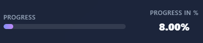

# Habit Tracker

A modern, responsive habit tracker application built with React, Node.js, and SQLite.



## Features

- **Dark Theme UI**: Beautiful glassmorphism design with modern scrollbars
- **Habit Tracking**: Daily tracking with tri-state toggle (Done, Failed, Empty)
- **Mobile-First Design**: 
  - Weekly pagination for mobile devices (7 days at a time)
  - Responsive week navigation with dots
  - Optimized touch targets
- **Analytics**: 
  - Monthly progress visualization
  - Weekly and monthly summary statistics
  - Best performing habits
- **Modern UI**:
  - Custom scrollbars with purple gradient theme
  - Smooth button hover effects
  - Glassmorphism panels
- **Responsive**: Works seamlessly on Desktop, Tablet, and Mobile
- **Admin Panel**: Easy management of habits (Add, Edit, Delete)
- **Data Export**: Export habit data to Excel/CSV

## Tech Stack

- **Frontend**: React, Vite, Vanilla CSS (Glassmorphism)
- **Backend**: Node.js, Express
- **Database**: SQLite3
- **Icons**: Lucide React
- **Charts**: Recharts

## Getting Started

1. **Clone the repository**
   ```bash
   git clone https://github.com/aravindhms/habit-tracker.git
   ```

2. **Install Dependencies**
   ```bash
   # Install server dependencies
   cd server
   npm install

   # Install client dependencies
   cd ../client
   npm install
   ```

3. **Run the Application**
   
   You can use the provided batch script (Windows):
   ```bash
   start_app.bat
   ```
   
   Or run manually:
   ```bash
   # Terminal 1: Start Server
   cd server
   npm start

   # Terminal 2: Start Client
   cd client
   npm run dev
   ```

4. **Access the Application**
   - Local: `http://localhost:5173`
   - Network: `http://<your-ip>:5173` (when started with `--host`)

## Mobile Features

- **Week Pagination**: Habit grid shows 7 days at a time on mobile
- **Navigation**: Swipe-friendly week navigation with previous/next buttons
- **Week Dots**: Quick navigation between weeks
- **Optimized Layout**: Larger touch targets and readable text on small screens

## License

MIT
